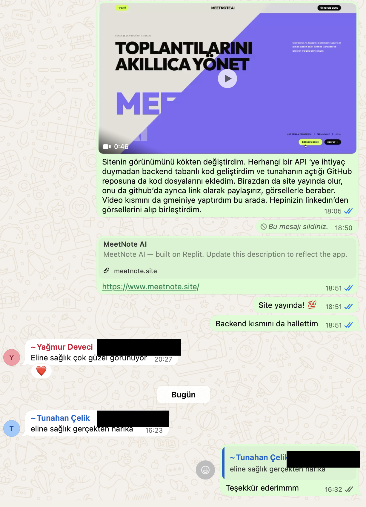
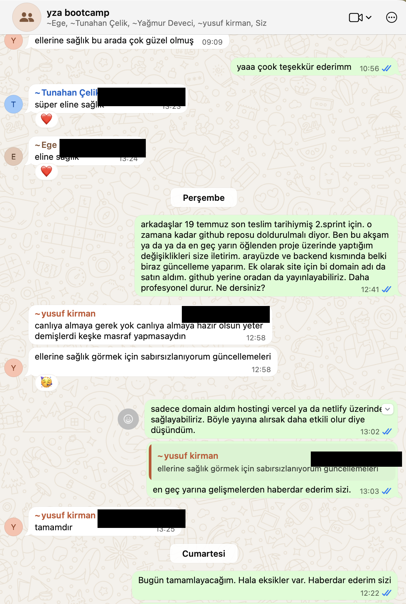

# Yapay Zeka Destekli Toplantı Notları Uygulaması

## Takım İsmi
Takım 55

## Ürün İle İlgili Bilgiler

### Takım Elemanları
- Yusuf Kirman: Scrum Master
- Yalın Ege Dalcan: Product Owner
- Tunahan Ebrar Çelik: Developer
- Yağmur Deveci: Developer
- Betül Kaya: Developer


## Ürün İsmi
-- MeetNote AI --

## Ürün Açıklaması
MeetNote AI, toplantı notlarını yapay zeka desteğiyle özetleyen web tabanlı bir uygulamadır. Kullanıcılar toplantı metinlerini veya notlarını sisteme girerek toplantı özeti, alınan kararlar ve aksiyon maddelerini hızlı bir şekilde görüntüleyebilir. Bu sayede toplantı sonrası not çıkarma süreci daha düzenli, hızlı ve verimli hale getirilir.

## Canlı Site
🔗 **[meetnote.site](https://meetnote.site)**


## Ürün Özellikleri
- Toplantı notu veya transkript girişi yapabilme
- Yapay zeka destekli toplantı özeti oluşturma
- Toplantıda alınan kararları listeleme
- Aksiyon maddelerini çıkarma
- Görev ve sorumlu kişi takibi yapabilme
- Kullanıcı dostu web arayüzü
- Toplantı çıktısını kopyalama veya düzenleme

## Farkımız
Piyasadaki toplantı asistanlarının büyük çoğunluğu **tek seferlik özetleyicidir**: bir toplantıyı özetler ve unutur. MeetNote AI'ı farklı kılan dört temel nokta:

| | Klasik Araçlar | MeetNote AI |
|---|---|---|
| **Toplantı Hafızası** | Her toplantı sıfırdan değerlendirilir, geçmiş unutulur. | Geçmiş kararları hatırlar; yeni toplantıda çelişki ve tekrarları otomatik yakalar. |
| **Gizlilik** | Toplantıya bot olarak katılır, ses/görüntü kaydeder. | Yalnızca metni analiz eder — ses ve görüntü hiç işlenmez, hiç saklanmaz. |
| **Hesap Verebilirlik** | Görev listesi çıkarır, takibi kullanıcıya bırakır. | Aksiyonların zamanında tamamlanma oranını izler, ekip güvenilirlik skoru üretir. |
| **Platform Bağımsızlığı** | Belirli bir video konferans aracına entegrasyon şartı. | Zoom, Teams, Meet, hatta kağıda alınmış notlar — hangi kaynaktan gelirse gelsin metinle çalışır. |


Bu farkların en somut sonucu **gizlilik ve maliyet** tarafında: MeetNote AI hiçbir ses/görüntü kaydı almadığı ve kendi sunucumuzda çalışan ücretsiz bir NLP motoru kullandığı için, üçüncü parti bir yapay zeka servisine bağımlı olmadan, KVKK/GDPR dostu ve sürdürülebilir şekilde çalışır (bkz. [Kullanılan Teknolojiler ve Mimari](#kullanılan-teknolojiler-ve-mimari)).

## Hedef Kitle
- Öğrenci proje ekipleri
- Yazılım geliştirme ekipleri
- Scrum / Agile takımları
- Start-up ekipleri
- Online toplantı yapan kullanıcılar
- Toplantı sonrası hızlı rapor almak isteyen ekipler

## Product Backlog URL
Notion Backlog Board:  
https://www.notion.so/Yapay-Zeka-ve-Teknoloji-Akademisi-BOOTCAMP-c6f1b456849c8217a86f01f787907c5e?source=copy_link

---

# Sprint 1

## Sprint Notları
Sprint 1 kapsamında ürün fikrinin netleştirilmesi, proje yönetim sürecinin oluşturulması ve geliştirme için gerekli temel hazırlıkların yapılması hedeflenmiştir. Bu sprintte ana amaç, ürünün kapsamını belirlemek, takım içi iletişim düzenini oluşturmak, backlog yapısını hazırlamak ve geliştirme sürecine başlamadan önce gerekli planlamaları tamamlamaktır.

## Sprint 1 Goal
Sprint 1’in hedefi; projenin kapsamını belirlemek, user story’leri oluşturmak, backlog düzenini hazırlamak, kullanılacak teknoloji stack’ine karar vermek ve GitHub proje yapısını oluşturmaktır.

## Backlog Düzeni ve Story Seçimleri
Backlog’umuz, projenin ilk aşamada ihtiyaç duyduğu temel işlere göre düzenlenmiştir. Sprint 1 için seçilen işler daha çok planlama, proje hazırlığı, takım organizasyonu ve teknik altyapı kurulumuna yöneliktir.

Story’ler yapılacak işlere yani task’lere bölünmüştür. Board üzerinde görevler “To-do”, “In progress” ve “Complete” kolonlarıyla takip edilmektedir. Böylece ekip üyeleri hangi görevin beklediğini, hangisinin devam ettiğini ve hangisinin tamamlandığını rahatça görebilmektedir.

## Sprint 1 İçin Seçilen Görevler

### To-do
- Teknoloji Stack’inin Belirlenmesi
- Wireframe Tasarımı
- Product Backlog Oluşturulması

### In Progress
- Sprint Review için Demo Planı Hazırlanması
- GitHub Düzenlenmesi
- User Story’lerin Yazılması
- Proje Kapsamının Belirlenmesi

### Complete
- GitHub Repository Açılması
- Aktarım için toplantı
- İletişim kanalı seçilmesi

---

## Daily Scrum
Daily Scrum toplantılarının ekip üyelerinin uygunluk durumuna göre çevrim içi iletişim kanalı üzerinden yapılmasına karar verilmiştir. Bu toplantılarda ekip üyeleri yaptıkları işleri, o gün üzerinde çalışacakları görevleri ve karşılaştıkları engelleri paylaşmaktadır.

Daily Scrum sürecinde aşağıdaki sorular üzerinden ilerlenmiştir:

- Dün ne yaptım?
- Bugün ne yapacağım?
- Önümde bir engel var mı?

### Daily Scrum Ekran Görüntüleri

Aşağıda Sprint 1 sürecinde yapılan Daily Scrum konuşmalarına ait ekran görüntüsü yer almaktadır.


---

## Sprint Board Update
Sprint board düzenli olarak güncellenmiştir. Görevlerin durumları aşağıdaki kolonlarda takip edilmiştir:

- To-do
- In progress
- Complete

Sprint board üzerinde görevler ekip üyelerine atanmış ve her görevin kategorisi belirlenmiştir. Agile, backend, frontend, yapay zeka ve diğer kategoriler kullanılarak işler daha düzenli hale getirilmiştir.

### Sprint Board Screenshot

Aşağıda Sprint 1’e ait güncel sprint board ekran görüntüsü yer almaktadır.


---

## Ürün Durumu
Sprint 1 sonunda ürünün temel fikri, hedef kitlesi ve geliştirme süreci netleştirilmeye başlanmıştır. Bu sprintte henüz tam çalışan bir ürün hedeflenmemiştir. Asıl amaç, Sprint 2’de geliştirilecek web tabanlı uygulama için gerekli planlama ve teknik hazırlıkları tamamlamaktır.

Bu nedenle Sprint 1 ürün durumu kapsamında ürünün ilk taslak arayüzü / wireframe çalışması paylaşılmıştır.

### Ürün Görselleri


*Yukarıdaki görseller Sprint 1'deki ilk taslak/wireframe çalışmasına aittir. Sprint 2'de geliştirilen güncel ürünün ekran görüntüleri için bkz. [Sprint 2 → Ürün Görselleri](#sprint-2).*

---

## Sprint Review
Sprint Review toplantısında Sprint 1 boyunca yapılan işler değerlendirilmiştir. GitHub repository’nin açılması, iletişim kanalının belirlenmesi ve proje aktarım toplantısının tamamlanması olumlu bulunmuştur. Devam eden görevlerin Sprint 1 sonunda tamamlanması ve Sprint 2’ye daha hazır bir şekilde geçilmesi hedeflenmiştir.

Alınan kararlar:

- Projenin web tabanlı geliştirilmesine karar verilmiştir.
- İlk aşamada toplantı notlarının metin olarak sisteme girilmesine karar verilmiştir.
- Yapay zeka çıktısı olarak toplantı özeti, kararlar ve aksiyon maddelerinin gösterilmesi planlanmıştır.
- Ses kaydı yükleme özelliğinin sonraki sprintlerde değerlendirilmesine karar verilmiştir.
- Sprint 2’de temel frontend ekranlarının ve yapay zeka entegrasyonunun geliştirilmesine karar verilmiştir.
- GitHub düzeninin tamamlanması ve görev takibinin board üzerinden yapılması kararlaştırılmıştır.

Sprint Review katılımcıları:

- Yusuf Kirman
- Tunahan Ebrar Çelik
- Yalın Ege Dalcan
- Yağmur Deveci
- Betül Kaya

---

## Sprint Retrospective
Sprint sonunda ekip içi çalışma süreci değerlendirilmiştir. İlk sprintte görev dağılımının genel olarak yapıldığı, fakat bazı görevlerin hâlâ devam ettiği görülmüştür. Bu nedenle bir sonraki sprintte görevlerin daha erken tamamlanması ve board güncellemelerinin daha düzenli yapılması gerektiğine karar verilmiştir.

Alınan kararlar:

- Görev dağılımı daha net yapılmalıdır.
- Her görev için sorumlu kişi board üzerinde belirtilmelidir.
- Sprint içindeki görev durumları düzenli olarak güncellenmelidir.
- Daily Scrum notları daha düzenli tutulmalıdır.
- Sprint 2’de geliştirme ve ürün çıktısına daha fazla odaklanılmalıdır.
- Frontend, backend ve yapay zeka görevleri daha net ayrılmalıdır.

---

# Sprint 2

## Sprint Notları
Sprint 1'de belirlenen hedef doğrultusunda, Sprint 2 kapsamında ürünün gerçek bir web uygulaması olarak geliştirilmesine, yapay zeka entegrasyonunun tamamlanmasına ve canlı ortama alınmasına odaklanılmıştır. Bu sprintte planlama aşamasından çıkılıp uçtan uca çalışan bir ürün ortaya konmuştur.

## Sprint 2 Goal
Sprint 2'nin hedefi; frontend arayüzünün tamamlanması, toplantı metni analiz eden bir backend ve yapay zeka motorunun geliştirilmesi, ürünün kendi alan adında (meetnote.site) canlıya alınması ve teknik dokümantasyonun tamamlanmasıdır.

## Sprint 2'de Tamamlanan İşler

### Done
- Frontend arayüzünün uçtan uca geliştirilmesi ve düzeltilmesi (responsive hatalar, tipografi, ekip bölümü, tanıtım videosu)
- Ürünün rakiplerinden farkını ortaya koyan "Farkımız" bölümünün tasarlanıp eklenmesi
- Backend geliştirme (Node.js + Express) ve `/api/analyze` uç noktasının oluşturulması
- Yapay zeka motorunun geliştirilmesi: Google Gemini entegrasyonu ve dış servise bağımlı olmayan, ücretsiz çalışan yerel NLP motoru (otomatik geçişli)
- Ürünün Vercel (frontend) ve Render (backend) üzerinde, kendi alan adımızda (meetnote.site) canlıya alınması
- Teknik dokümantasyonun (mimari, teknoloji yığını, kurulum) yazılması

## Ürün Durumu
Sprint 2 sonunda ürün, planlama aşamasından çıkıp **çalışan, canlı bir web uygulaması** haline gelmiştir. [meetnote.site](https://meetnote.site) adresinden gerçek bir toplantı metni girilerek özet, kararlar ve aksiyon maddeleri üretilebilmektedir.

### Ürün Görselleri


## Daily Scrum
Sprint 2 boyunca ekip içi iletişim, ekibin ortak WhatsApp grubu üzerinden yürütülmüştür. Ekip üyeleri geliştirme sürecindeki ilerlemeyi, alan adı kararını ve canlıya alma sürecini bu kanal üzerinden paylaşmıştır (gizlilik amacıyla telefon numaraları kapatılmıştır).





## Sprint Review
Sprint 2 sonunda ekip, canlıya alınan ürünü birlikte değerlendirmiştir. Sprint 1'de hedeflenen "temel frontend ekranlarının ve yapay zeka entegrasyonunun geliştirilmesi" hedefine ulaşılmış, bunun ötesinde ürün production ortamına taşınarak gerçek kullanıcıların erişebileceği bir aşamaya getirilmiştir.

## Sprint Retrospective
Geliştirme sürecinde karşılaşılan önemli bir teknik zorluk, ücretsiz yapay zeka API anahtarı alım sürecinde yaşanan erişim engelidir. Bu durum, ekibi tek bir dış servise bağımlı kalmak yerine kendi sunucumuzda çalışan, hiçbir API anahtarı gerektirmeyen bir yerel analiz motoru geliştirmeye yöneltmiştir. Sonuç olarak ürün, dış servis kesintilerinden etkilenmeyen, daha dayanıklı ve sürdürülebilir bir mimariye kavuşmuştur.

Alınan kararlar:
- Kritik özellikler tek bir dış servise bağımlı kılınmamalı, yedek/fallback mekanizmaları tasarlanmalıdır.
- Ürün erken aşamada canlı ortama alınmalı, gerçek koşullarda test edilmelidir.
- Sonraki sprintte, ürünün "Farkımız" bölümünde vurgulanan toplantılar arası hafıza ve hesap verebilirlik özelliklerinin gerçek işlevlere dönüştürülmesi hedeflenmektedir.

---

# Kullanılan Teknolojiler ve Mimari

## Klasörler
- `meetnote-ai/` — React + Vite frontend (site arayüzü)
- `api-server/` — Express backend (`/api/analyze` uç noktası, toplantı metnini analiz eder)

## Mimari Genel Bakış

```
┌────────────────────┐        /api/*        ┌──────────────────────┐
│   meetnote-ai       │  ───────────────────▶ │     api-server        │
│   (React + Vite)    │   Vercel rewrite /    │   (Node + Express)     │
│   Vercel — Statik   │   Vite dev proxy       │   Render — Web Service │
└────────────────────┘                        └───────────┬───────────┘
        ▲                                                  │
        │ https://meetnote.site                            ▼
   Kullanıcı                                    ┌───────────────────────┐
                                                 │  Yapay Zeka Katmanı    │
                                                 │  ─────────────────    │
                                                 │  GEMINI_API_KEY varsa: │
                                                 │  Google Gemini (ücr.)  │
                                                 │  Yoksa / başarısızsa:  │
                                                 │  Yerel NLP motoru      │
                                                 │  (textAnalyzer.ts)     │
                                                 └───────────────────────┘
```

İstek akışı: Kullanıcı `meetnote.site`'a girer → frontend statik olarak Vercel'den servis edilir → "Analiz Et" tıklandığında tarayıcı `/api/analyze`'a istek atar → Vercel bu isteği `vercel.json` içindeki rewrite kuralıyla Render'daki `api-server`'a yönlendirir → sunucu metni analiz edip `{ summary, decisions, actions }` JSON'unu döner.

## Frontend — `meetnote-ai/`
- **React 19** + **TypeScript** — bileşen tabanlı arayüz
- **Vite 7** — geliştirme sunucusu ve production build aracı
- **Tailwind CSS 4** — utility-first stil sistemi
- **Framer Motion** — scroll-tetiklemeli animasyonlar
- **Radix UI tabanlı bileşen kütüphanesi** (shadcn tarzı) — erişilebilir UI primitifleri (dialog, tabs, tooltip vb.)
- Barındırma: **Vercel** (statik site + `/api/*` rewrite ile backend'e proxy)

## Backend — `api-server/`
- **Node.js** + **Express 5** — HTTP sunucusu ve `/api` router'ı
- **TypeScript** — tip güvenliği
- **Zod** — istek gövdesi doğrulama (`POST /api/analyze` için `text` alanı zorunlu, maksimum 20.000 karakter)
- **Pino** — yapılandırılmış (structured) loglama
- **express-rate-limit** — `/api/analyze` uç noktasını IP başına 10 dakikada 20 istekle sınırlar, paylaşılan ücretsiz AI kotasının kötüye kullanımını engeller
- Barındırma: **Render.com** (ücretsiz Web Service katmanı)

## Yapay Zeka Katmanı
İki motorlu, otomatik geçişli bir tasarım:

1. **Google Gemini (isteğe bağlı, ücretsiz katman)** — `GEMINI_API_KEY` ortam değişkeni tanımlıysa kullanılır, en yüksek kaliteli sonucu verir.
2. **Yerel NLP motoru** (`api-server/src/lib/textAnalyzer.ts`) — anahtar tanımlı değilse veya Gemini isteği herhangi bir sebeple başarısız olursa **otomatik olarak** devreye girer. Frekans tabanlı çıkarımsal özetleme (extractive summarization) ve Türkçe karar/aksiyon kalıp eşleştirmesi kullanır; hiçbir dış servise, API anahtarına veya internet bağlantısına ihtiyaç duymadan sunucu içinde çalışır.

Bu tasarımın sonucu: proje **hiçbir zaman "AI çalışmıyor" hatası vermez** ve hiç kimseye asla ücret yansımaz — ne bizim altyapımıza ne de kullanıcıya.

## Kurulum (Yerel Geliştirme)

```bash
# Frontend
cd meetnote-ai
npm install
npm run dev   # http://localhost:5173

# Backend (ayrı bir terminalde)
cd api-server
npm install
cp .env.example .env
npm run dev   # http://localhost:8080
```

Frontend, Vite dev proxy ile `/api/*` isteklerini otomatik olarak backend'e yönlendirir; production'da bu işi `meetnote-ai/vercel.json` içindeki rewrite kuralı yapar. Ücretsiz bir Gemini anahtarı almak isterseniz `api-server/README.md` dosyasına bakın (tamamen isteğe bağlıdır).
